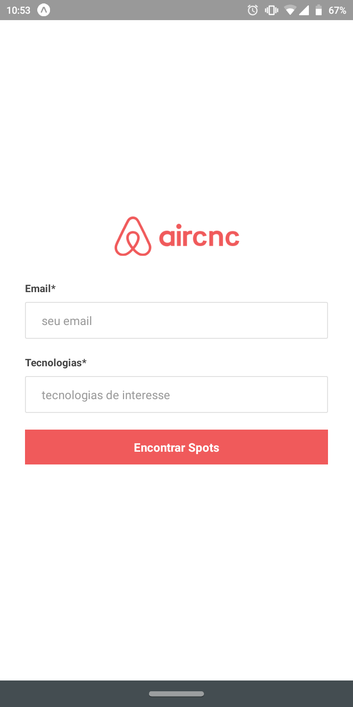
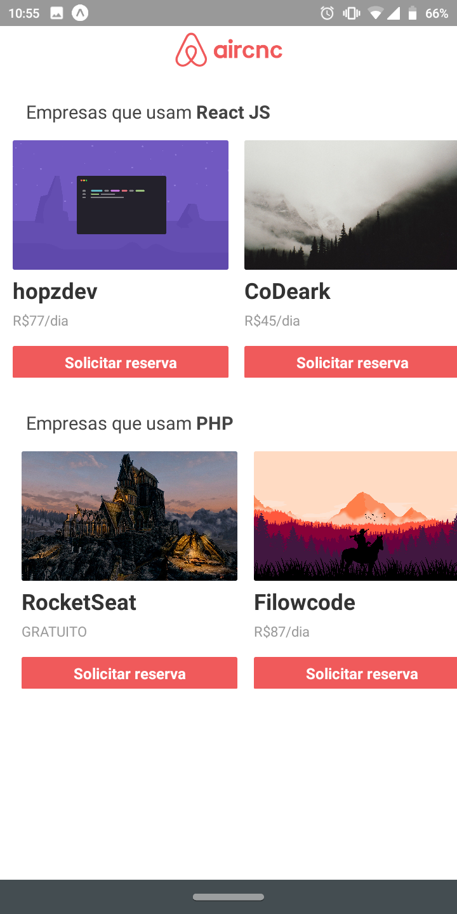
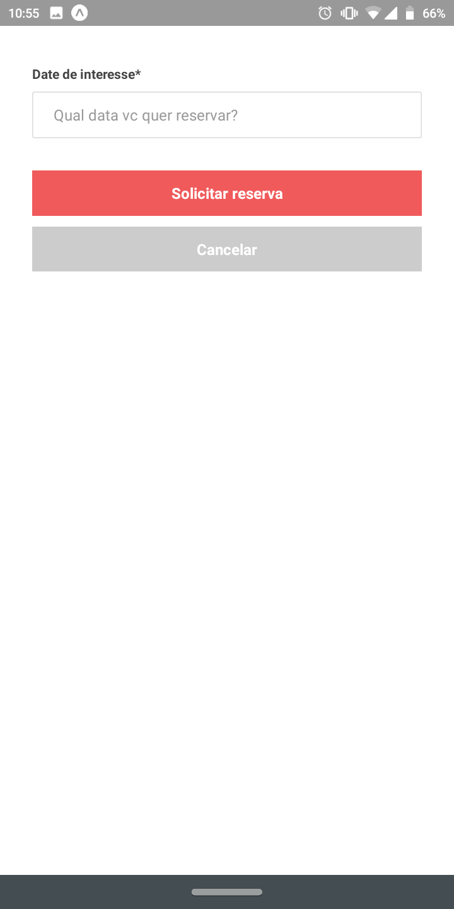

# AirCnC **MOBILE** - *OminiStack 9.0*

## [VISUALIZAR PARTE BACK-END](https://github.com/honassis/aircnc-backend)
## [VISUALIZAR PARTE FRONT-END](https://github.com/honassis/aircnc-frontend)
> contato: honassislopes@gmail.com

## Sobre o sistema:
**AirCnC** foi um sistema feito da semana [**OminiStack 9.0**](https://rocketseat.com.br/starter) , ele foi  basicamente um sistema feito para conectar progamadores com empresas e assim fazer novos contatos, no sistema como cliente é possível selecionar suas tecnologias de interesse, visualizar spots de acordo com seus interesses de tecnologia, como empresa é possível cadastrar spots, aceitar/rejeitar convites

## Sobre o Mobile:
feito em React Native, Expo, Axios e Socket.io para a comunicação do backend, toda a estilização foi feita "a mão", sem o auxílio de nenhum framework, suporte total a **Android** */* **iOS**

## outras informações: 
* é possível alterar o endereço de comunicação com o  back-end em **src/services/api.js**
> contato: honassislopes@gmail.com